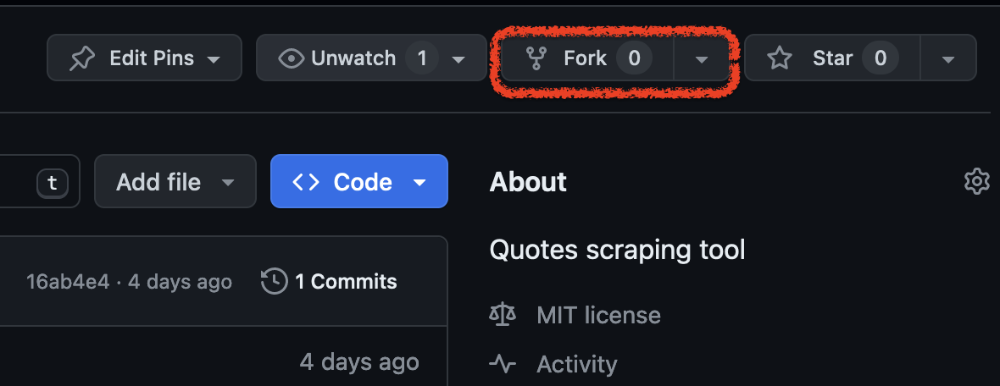
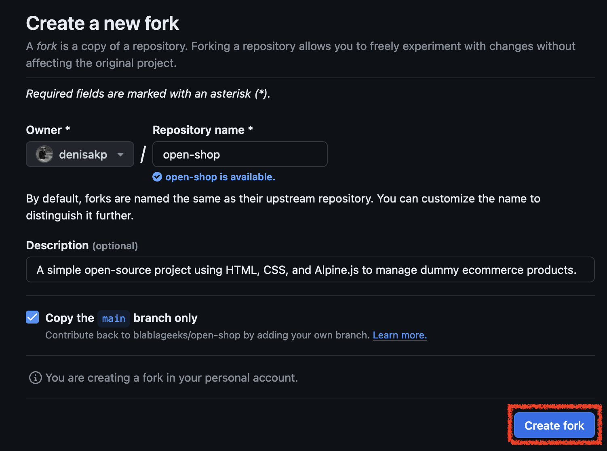
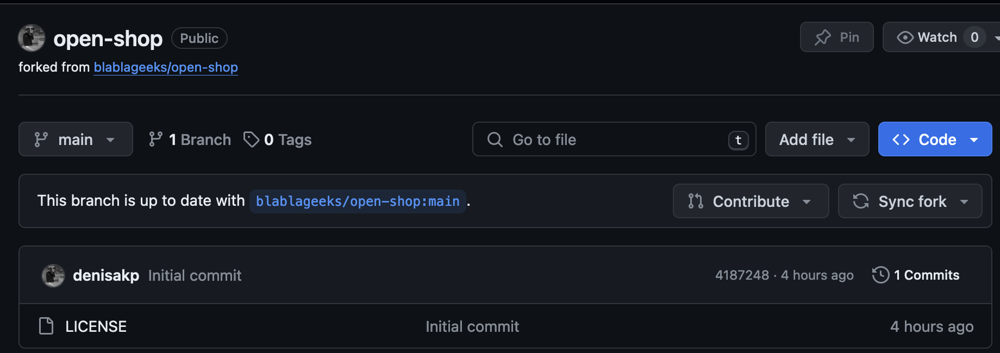
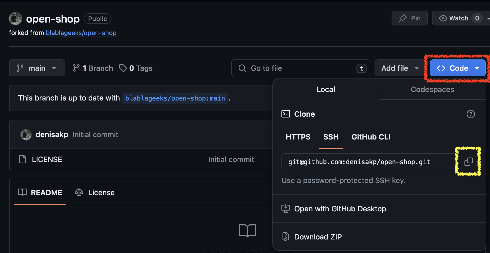
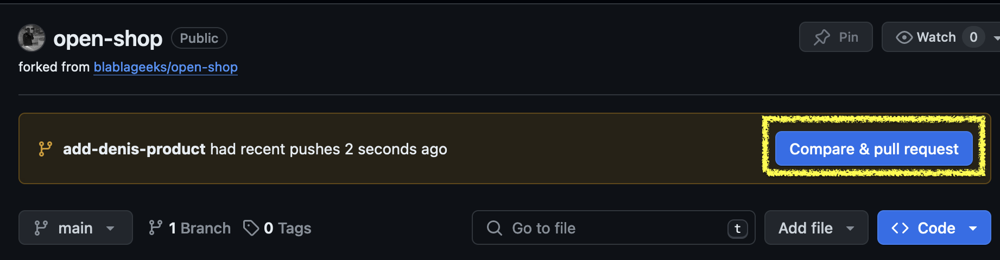
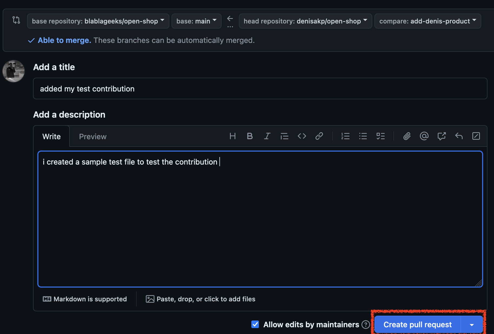

# Contributing to Open-Shop Tool project

Welcome to Open-Shop project! We appreciate your interest in contributing to our open-source project.
Before you get started, please take a moment to review our contribution guidelines.

## Types of Contributions We Welcome

- **Bug Fixes**: Help us identify and fix issues in the project.
- **New Features**: Contribute new features and enhancements to improve the project.
- **Documentation**: Improve project documentation, README files, or provide examples.
- **Bug Reports**: Report any issues, errors, or bugs you encounter.
- **Feedback**: Share your feedback, ideas, or suggestions for improvement.
- **Testing**: Help us test the project, identify edge cases, and ensure its reliability.
- **Code Reviews**: Review pull requests, provide feedback, and help maintain code quality.

## How to contribute

To contribute to Open-Shop project, follow these steps:

### Fork the repository to your GitHub account

Fork this repository by clicking on the fork button on the top of this page.



Then click on **Create fork** button to create a copy of this repository in your GitHub account.



If everything goes smoothly, you must have this exact screen



### Clone the repository

Now that we've successfully forked the repository and copied it into our account, we'll clone it, which essentially
creates a local copy of the project on your system. To clone a project locally, click the code button (red) followed by
the clipboard icon button (yellow). This step copies the repository link, which will be used to clone the project
locally.



Now clone the forked repository into your system. Navigate to your GitHub account, open the forked repository, click
the code button, and then choose the copy to clipboard icon.

> I would propose that you use HTTPS instead of SSH. To use SSH, you must first generate an SSH key and then set up your
GitHub account to use it. You can discover additional information on how to process that by following 
[this link](https://docs.github.com/en/authentication/connecting-to-github-with-ssh/adding-a-new-ssh-key-to-your-github-account).
But, as I stated, I merely recommend that you pick HTTPS because it is a simpler option.


Now, open your terminal and run the following git command:
```shell
git clone https://github.com/your-username/open-shop.git # just paste using Ctrl+v to paste the url
cd open-shop # to move into the project folder
```

### Create a Git branch for your contribution

To create a git branch, run the following branch (make sure you run the previous command, and you're inside the project
folder):
```shell
git checkout -b your-branch-name
# for example: git checkout add-denis-product
```

### Make the necessary changes and commit your changes

Through your preferred code editor, add the wanted changes. As we mention it earlier it in
[this section](#types-of-contributions-we-welcome) there are multiple ways to contribute to this project.

But maybe you want to a new product? Then open `src/assets/data/products.js` with your preferred text editor, and add
the product object at the end of the product array.

```js
const products = [
    {
        name: "product name",
        description: "product description",
        sku: "product sku",
        price: 436.99,
        image: "https://images.unsplash.com/photo-xid.png",
        likes: 25,
        categories: ["category 1", "category 2"],  
    }
];

window.products = products;

```

After you've applied your changes, run `git status` command in your terminal to see which files have changed:
```shell
git status
```

Then add those changes to the branch you created earlier by running `git add` command:
```shell
git add src/assets/data/products.js
```

Now commit your changes using the `git commit` command:
```shell
git commit -m "added my product"
```

### Publish your changes to GitHub

Now let's publish your changes using the `git push` command:
```shell
git push -u origin your-branch-name
# replace your-branch-name with the name of the branch you created earlier
```

### Submit your branch for review: create a Pull Request

If you go to your repository on GitHub, you'll see a screen like this:



Click on `Compare & pull request` button (framed in red) and you will see the following screen:



> Your changes can only be added once your pull request has been reviewed and merged only then would you be able to
see you work on the main branch!

🎉 HOURAAA !!! All Done, Thank you, mate, for your time and effort! 👏


We'll soon merge your contribution into the main branch of this project. You will receive a notification after
the modifications have been integrated.

## Pull Request Guidelines

When creating a pull request, please follow these guidelines:

- Provide a clear and concise description of your changes.
- Reference any relevant issues or related pull requests.
- Ensure your code is well-documented and includes inline comments where necessary.
- Test your changes thoroughly and provide evidence of successful testing.
- Be responsive to any feedback or comments on your pull request.

## Code of Conduct

We enforce a Code of Conduct to ensure a welcoming and inclusive environment for all contributors. Please review our
[Code of Conduct](CODE_OF_CONDUCT.md) to understand our community standards.

## Our Commitment

Our project maintainers are committed to responding promptly to issues, pull requests, and inquiries from contributors.
We appreciate your time and effort in making this project better.

Thank you for contributing to Open-Shop project!

## Attribution

We would like to acknowledge and thank all our contributors for their valuable contributions to this project.
Your dedication and support are greatly appreciated.