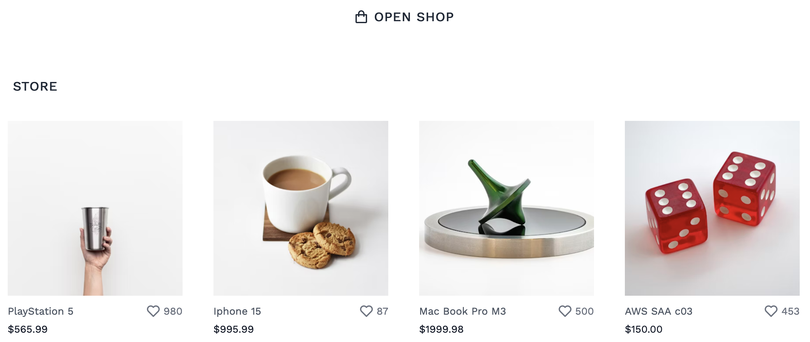

# Blabla Geeks Open-Shop 
 
Welcome to Open-Shop, an open source project designed to simplify the entry into open source contributions through a
practical, hands-on approach. Open-Shop is a minimalistic e-commerce store built using HTML, CSS with Tailwind, and
Alpine.js.

## Objective

Our goal is to provide a welcoming platform for developers at all levels to contribute to a growing project, understand
the workflow of open source contributions, and improve their coding and collaboration skills.

## Features

Open-Shop includes basic functionalities of an e-commerce site, including:
- Product listings
- Adding new products via a static JavaScript array
- Responsive design with Tailwind CSS

## How to Contribute

We welcome contributions of all kinds, from bug fixes to feature additions. Here are some ways you can contribute:
- **Add a Product**: Enhance the product array with new items.
- **New Features**: Implement additional features such as pagination, filtering, product search, and product description modals.
- **Improve Documentation**: Help make our documentation more comprehensive and easier to understand.
- **Write Tests**: Contribute to the project's robustness with tests.
- **Bug Reporting and Fixes**: Spot a bug? Report it, or even better, fix it!
- **Feedback**: Provide feedback on features and functionality to help improve Open-Shop.

## Getting Started

To get started with contributing to Open-Shop, follow these steps:

### Prerequisites

Ensure you have the following installed:
- a web browser
- a terminal to hit git command

### Setup

1. Fork and clone the repository:
   ```
   git clone https://github.com/your-username/open-shop.git
   cd open-shop
   ```

2. Test the project:
   Open the `src/index.html` file with your preferred web browser. (Because we're CDN, you should be connected to the
   internet to download the necessary files from CDN.)

If everything goes smoothly, you should see our store with existing products. The store may have altered due to
increased product additions from other contributors like you.




## How to Add a Product

To add a product to the Open-Shop:
1. Navigate to the `src/assets/data/products.js` file.
2. Add a new object at the beginning of the `products` array with the following structure:
   ```javascript
   const products = [
    {
        name: "product name",
        description: "product description",
        sku: "product sku",
        price: 436.99,
        image: "https://images.unsplash.com/photo-xid.png",
        likes: 25,
        categories: ["category 1", "category 2"],  
    }
   ];
   
   window.products = products;
   ```
   This will ensure that your product was correctly added and avoid you from scrolling for an extended period of time, as we have not yet included pagination or product search features.

3. Commit your changes and submit a pull request.

## Community and Support

Join our community on [Discord](#blabla-geeks-open-shop-) to get help, discuss ideas, and interact with fellow contributors!

## License

Open-Shop is open source licensed under the MIT license.